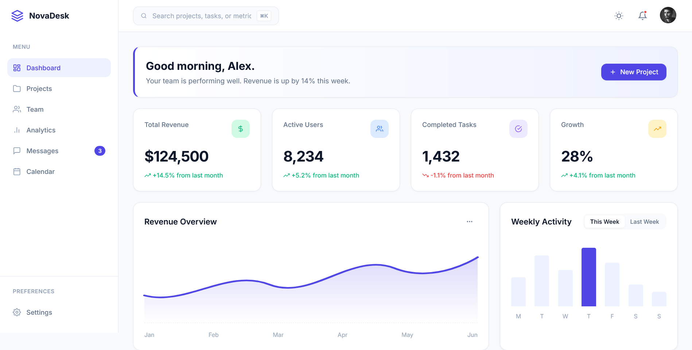
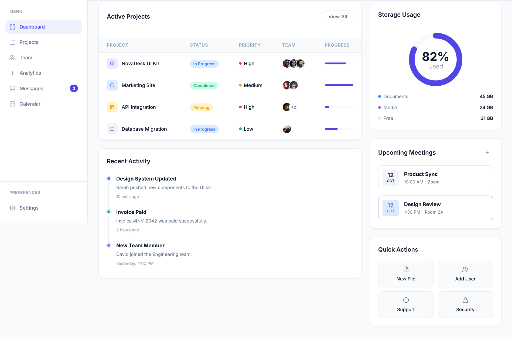
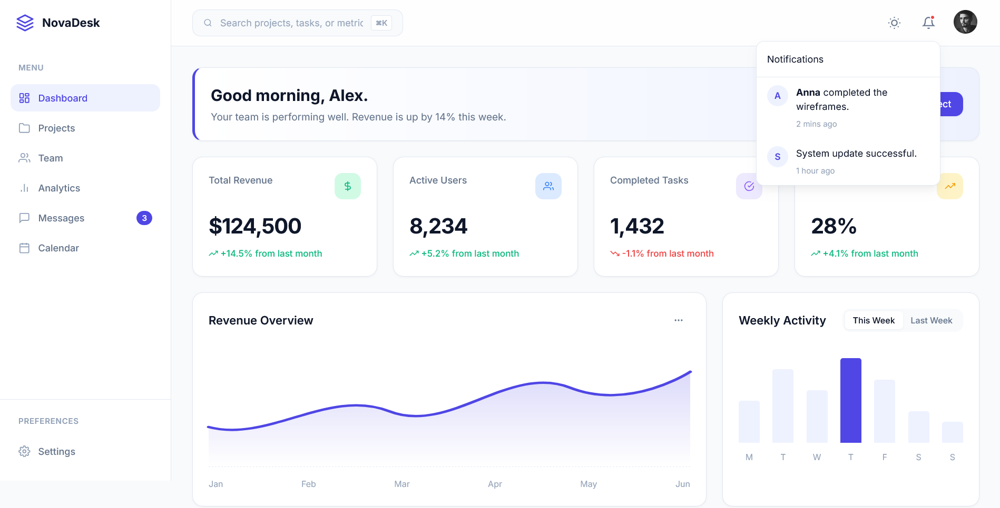
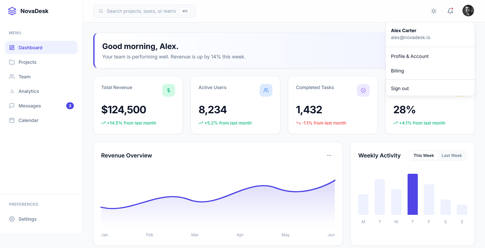

# 📊 NovaDesk Dashboard

A modern dashboard interface built using HTML, CSS and JavaScript.

NovaDesk Dashboard demonstrates how analytics dashboards can be designed with clean layouts, reusable components and responsive user interfaces.

## Live Demo

https://aman-luc.github.io/NovaDesk-Dashboard/

## Features

- Dashboard Overview
- Statistics Cards
- Sidebar Navigation
- User Interface Components
- Responsive Layout
- Modern Dashboard Design
- Clean Code Structure

## Tech Stack

- HTML5
- CSS3
- JavaScript

## Project Goal

This project was built to improve frontend dashboard development skills while focusing on clean layouts, usability and responsive design.

## Preview

### Dashboard

### Project Management

### Notifications

### User Profile

## Author

Aman Kumar

GitHub:
https://github.com/Aman-luc
